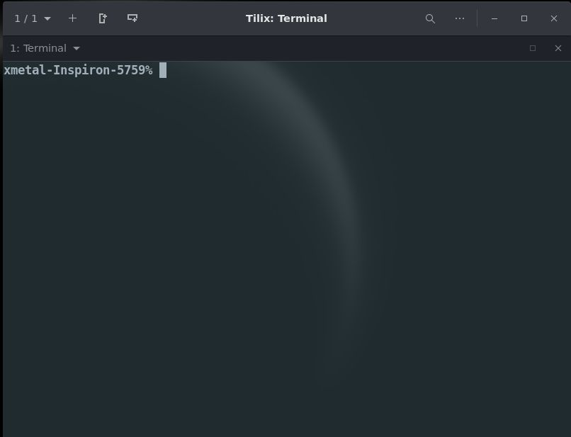
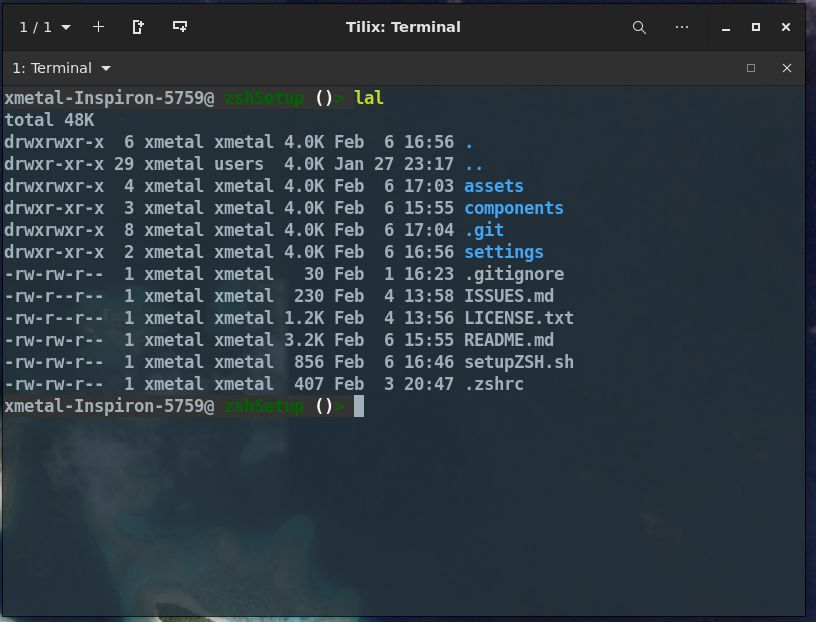

# zshSetup

## Goal

While I may in fact do the same thing I did with my [Linux Setup Scripts](https://github.com/Xmetalfanx/linuxSetup).  The goal for right now is similiar to the origins of that project.  A way to setup zsh (Linux in the other case) fast on a fresh setup.

Menus and "Do you want to install A or B?" type things may come later but this is just a fast set of tasks I have tossed together for now .. again like the origins of my [Linux Setup Scripts](https://github.com/Xmetalfanx/linuxSetup).

## Slim vs Complete option 
- Complete 
  - Installs plugins sourced from zsh-users and ohMyZsh repos that I find at least possibly useful
  - Sets up history file in ~/.cache/zsh/history
  - Sets up Prompt "theme"
  - Sets up Aliases

- Medium 
  - Sets up history file in ~/.cache/zsh/history
  - Sets up Prompt "theme"
  - Sets up Aliases

- Slim 
  - Sets up history file in ~/.cache/zsh/history
  - Sets up Aliases

## Screenshots 

| Before/Vanilla zsh                                   | After running (Complete option) Scripts               |
|------------------------------------------------------|-------------------------------------------------------|
|  |  |

## Credits

The harcoded plugins I include belong to their projects and developers .. I am not even sure i am keeping these hard-coded in... ALL CREDIT for their code goes to them 

## Plugins

### [Oh-my-zsh](https://github.com/ohmyzsh/ohmyzsh)

- DirHistory: https://github.com/ohmyzsh/ohmyzsh/tree/master/plugins/dirhistory
  - Allows you to use Alt+Arrow Keys to navigate between say the PWD and Parent or Child directories
  - issue: I find this doesn't work in the terminal "inside of" vscode 
- sudo: https://github.com/ohmyzsh/ohmyzsh/tree/master/plugins/sudo
  - lets you  press ESC twice and it will add "sudo" to the start of lines you may have forgotten to add it to

- Plugins disabled for now
  - Some distro bases are having trouble with these out of the box, so I have decided to disable them for a smoother experience until I figure things out.

  -  Colorize: https://github.com/ohmyzsh/ohmyzsh/tree/master/plugins/colorize
     - allows you to type "ccat <file>" to show a file in cat but with syntax coloring
  - colored-man-pages: https://github.com/ohmyzsh/ohmyzsh/tree/master/plugins/colored-man-pages
    - shows man pages with colored syntax highlighting 

### [zsh-users](https://github.com/zsh-users)

- Enabled by Default
  - zsh-autosuggestion: https://github.com/zsh-users/zsh-autosuggestions
  - zsh-syntax-highlighting: https://github.com/zsh-users/zsh-syntax-highlighting
- Not Enabled by Default
  - zsh-completions: https://github.com/zsh-users/zsh-completions
  - zsh-history-substring-search: https://github.com/zsh-users/zsh-history-substring-search

#### disabled 

- zsh-completions: https://github.com/zsh-users/zsh-completions

### [zsh-autocomplete]()

## Theming
- The only theme code I have now is based on (the overall look, maybe not default color scheme) [BobTheFish](https://github.com/oh-my-fish/theme-bobthefish) used in the [Fish Shell](https://fishshell.com/)/[Fish on Github](https://github.com/fish-shell/fish-shell) from [OhMyFish](https://github.com/oh-my-fish/oh-my-fish)

- I have ideas to allow users to use different colors for different parts of the theme and also possible have it where i can add diffferent themes and most of the code stays the same... that is for down the line though 

## Projects

Projects I either use parts of in this script/find interesting and may use/are just similiar (setting up zsh) somehow 

- [fancy-git](https://github.com/diogocavilha/fancy-git)
- [OhMyZsh](https://github.com/ohmyzsh/ohmyzsh)
- [zsh-users](https://github.com/zsh-users)
- [zsh-git-prompt](https://github.com/zsh-git-prompt/zsh-git-prompt)
