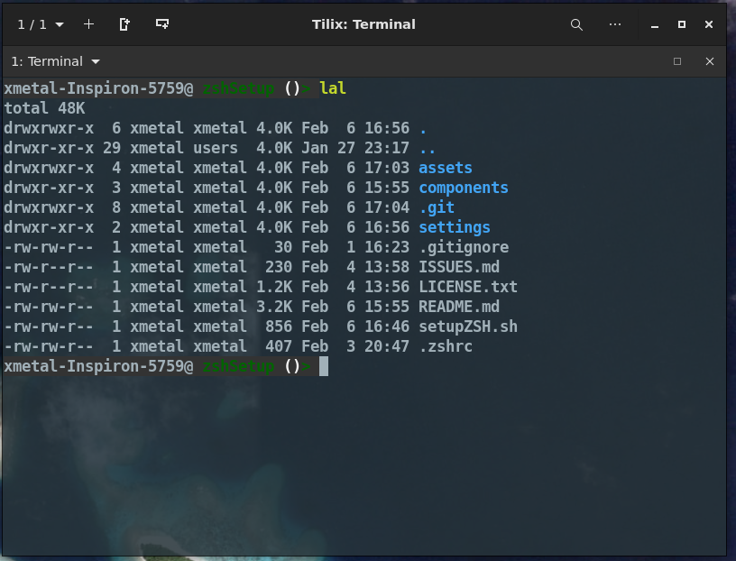

# zshSetup

- [zshSetup](#zshsetup)
  - [Goal](#goal)
  - [Slim vs Complete option](#slim-vs-complete-option)
  - [Screenshots](#screenshots)
  - [Credits](#credits)
  - [Plugins](#plugins)
    - [Oh-my-zsh](#oh-my-zsh)
    - [zsh-users](#zsh-users)
  - [Theming](#theming)
  - [Projects](#projects)

## Goal

While I may in fact do the same thing I did with my [Linux Setup Scripts](https://github.com/Xmetalfanx/linuxSetup).  The goal for right now is similiar to the origins of that project.  A way to setup zsh (Linux in the other case) fast on a fresh setup.

Menus and "Do you want to install A or B?" type things may come later but this is just a fast set of tasks I have tossed together for now .. again like the origins of my [Linux Setup Scripts](https://github.com/Xmetalfanx/linuxSetup).

## Slim vs Complete option 
- Complete 
  - Installs plugins sourced from zsh-users and ohMyZsh repos that I find at least possibly useful
  - Sets up history file in ~/.cache/zsh/history
  - Sets up Prompt "theme" based on BobTheFish Fish theme
  - Sets up basic Aliases

- Medium 
  - Sets up history file in ~/.cache/zsh/history
  - Sets up Prompt "theme" based on BobTheFish Fish theme
  - Sets up basic Aliases

- Slim 
  - Sets up history file in ~/.cache/zsh/history
  - Sets up Prompt "theme" based on BobTheFish Fish theme
  - Sets up basic Aliases
  - Sets up Git Aliases (since the plugins are not used here and one of them has mostly the same stuff, i do not have this on the Complete option )

## Screenshots 

## Credits

The harcoded plugins I include belong to their projects and developers .. I am not even sure i am keeping these hard-coded in... ALL CREDIT for their code goes to them 

## Plugins

### [Oh-my-zsh](https://github.com/ohmyzsh/ohmyzsh)

- Colorize: https://github.com/ohmyzsh/ohmyzsh/tree/master/plugins/colorize
  - allows you to type "ccat <file>" to show a file in cat but with syntax coloring 
- colored-man-pages: https://github.com/ohmyzsh/ohmyzsh/tree/master/plugins/colored-man-pages
  - shows man pages with colored syntax highlighting 
- DirHistory: https://github.com/ohmyzsh/ohmyzsh/tree/master/plugins/dirhistory
  - Allows you to use Alt+Arrow Keys to navigate between say the PWD and Parent or Child directories 
  - issue: I find this doesn't work in the terminal "inside of" vscode 
- sudo: https://github.com/ohmyzsh/ohmyzsh/tree/master/plugins/sudo
  - lets you  press ESC twice and it will add "sudo" to the start of lines you may have forgotten to add it to

### [zsh-users](https://github.com/zsh-users)

- zsh-autosuggestion: https://github.com/zsh-users/zsh-autosuggestions
- zsh-history-substring-search: https://github.com/zsh-users/zsh-history-substring-search
- zsh-syntax-highlighting: https://github.com/zsh-users/zsh-syntax-highlighting

## Theming
- The only theme code I have now is based on (the overall look, maybe not default color scheme) [BobTheFish](https://github.com/oh-my-fish/theme-bobthefish) used in the [Fish Shell](https://fishshell.com/)/[Fish on Github](https://github.com/fish-shell/fish-shell) from [OhMyFish](https://github.com/oh-my-fish/oh-my-fish)

## Projects

Projects I either use parts of in this script/find interesting and may use/are just similiar (setting up zsh) somehow 

- [fancy-git](https://github.com/diogocavilha/fancy-git)
- [OhMyZsh](https://github.com/ohmyzsh/ohmyzsh)
- [zsh-users](https://github.com/zsh-users)
- [zsh-git-prompt](https://github.com/zsh-git-prompt/zsh-git-prompt)
